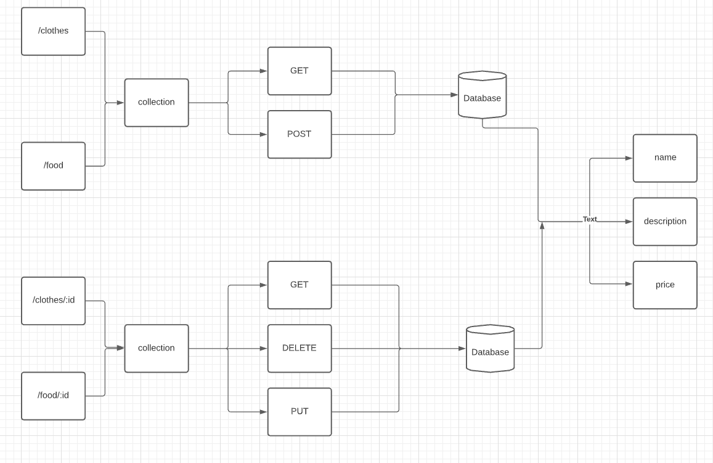

# LAB - Class 04

## Project: Api Server

### Author: Omar Ramadan

### Links and Resources

- [ci/cd](https://github.com/401-repos/api-server/actions)
- [back-end server url](https://api-server-0.herokuapp.com/)

### Setup

#### `.env` requirements (where applicable)

i.e.

- `PORT` - Port Number
- `MONGODB_URI` - URL to the running mongo instance/db

#### How to initialize/run your application (where applicable)

- `npm start`

#### Tests

- `npm test`

#### UML

